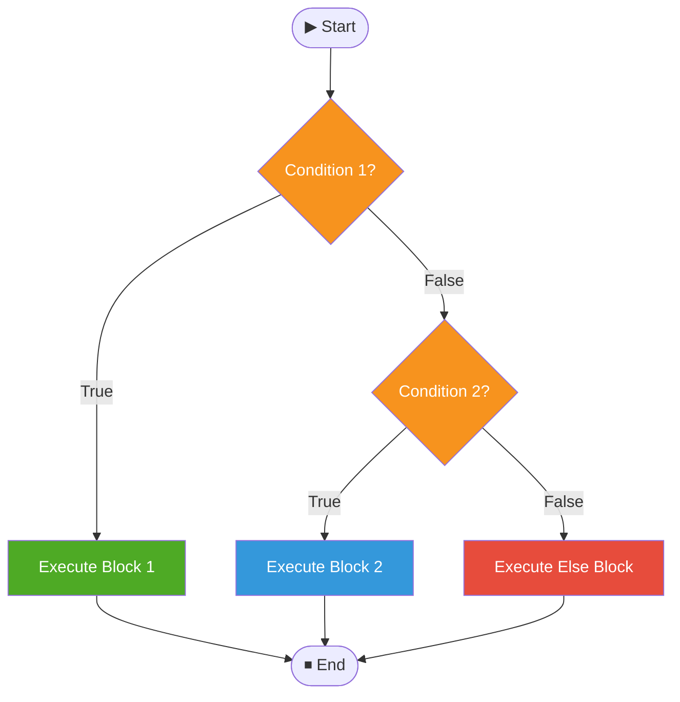
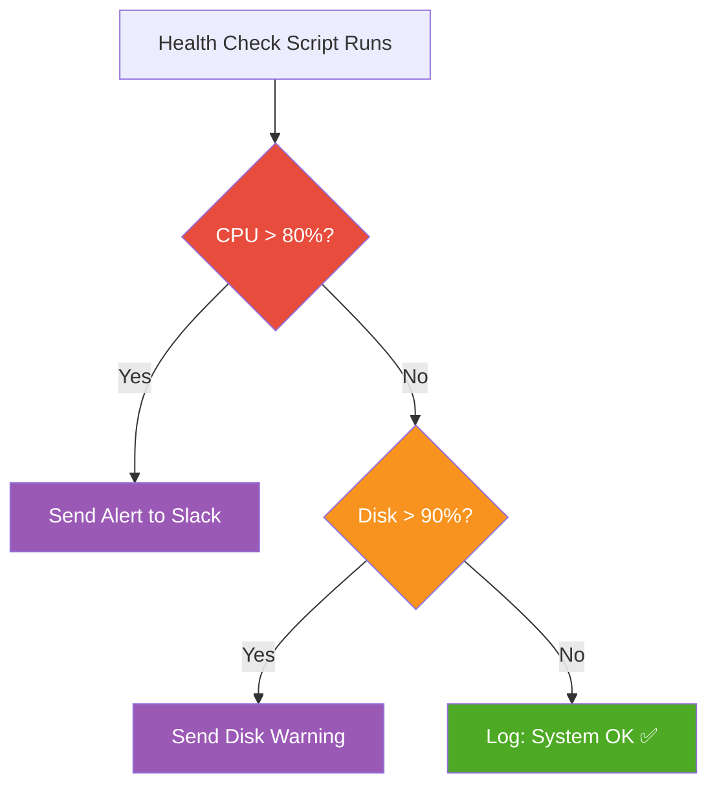

<div align="center">

# 🔀 Day 05 — Conditional Statements (if-elif-else)


> *"Conditions give scripts a brain — they let your automation think, decide, and act accordingly."*

</div>

---

## 📌 Introduction

**Conditional Statements** allow your script to execute different blocks of code based on whether a condition is **true or false**. This is how scripts make decisions — the core of intelligent automation.

---

## 🧠 Key Concepts

### if-elif-else Flow



### Syntax

```bash
if [ condition-1 ]; then
    # statement block 1

elif [ condition-2 ]; then
    # statement block 2

else
    # default block

fi
```

---

## 💻 Commands & Examples

### Script 01 — Voting Eligibility

```bash
#!/bin/bash

echo "Enter Your age"
read AGE

if [ $AGE -ge 18 ]; then
    echo "✅ Eligible for vote"
else
    echo "❌ Not Eligible for vote"
fi
```

**Sample Output:**
```
Enter Your age
20
✅ Eligible for vote
```

---

### Script 02 — Positive, Negative or Zero

```bash
#!/bin/bash

echo "Enter Number"
read A

if [ $A -gt 0 ]; then
    echo "✅ It is a Positive number"

elif [ $A -lt 0 ]; then
    echo "🔻 It is a Negative number"

else
    echo "⭕ It is Zero"
fi
```

---

### Script 03 — Even or Odd

```bash
#!/bin/bash

echo "Enter a number"
read NUM

if (( NUM % 2 == 0 )); then
    echo "$NUM is Even 🟢"
else
    echo "$NUM is Odd 🔴"
fi
```

---

### Script 04 — Grade Checker

```bash
#!/bin/bash

echo "Enter your marks (out of 100)"
read MARKS

if [ $MARKS -ge 90 ]; then
    echo "Grade: A+ 🌟"
elif [ $MARKS -ge 75 ]; then
    echo "Grade: A 🎯"
elif [ $MARKS -ge 60 ]; then
    echo "Grade: B 👍"
elif [ $MARKS -ge 40 ]; then
    echo "Grade: C ✅"
else
    echo "Grade: F ❌ - Please improve"
fi
```

---

## 🌍 Real-World Usage



```bash
#!/bin/bash
# Real-world: Service health check

SERVICE="nginx"

if systemctl is-active --quiet $SERVICE; then
    echo "✅ $SERVICE is running"
else
    echo "⚠️  $SERVICE is DOWN — restarting..."
    systemctl restart $SERVICE
fi
```

---

## 📋 Summary

| Statement | Purpose |
|---|---|
| `if [ condition ]` | Check the primary condition |
| `elif [ condition ]` | Check additional conditions |
| `else` | Default block when no condition matches |
| `fi` | Closes the if-elif-else block |
| `-eq`, `-gt`, `-lt` | Numeric comparison operators |
| `==`, `!=` | String comparison operators |

---

## ⏭️ What's Next?

> 🔜 **Day 06 — Looping Statements (for & while)**
> Repeat tasks efficiently with `for` and `while` loops!

---

## 👨‍💻 Author & Support

<div align="center">

Made with ❤️ as part of the **DevOps Zero to Hero** series

[](https://github.com)
[](https://linkedin.com)

⭐ **Star this repo** if it helped you!

</div>
