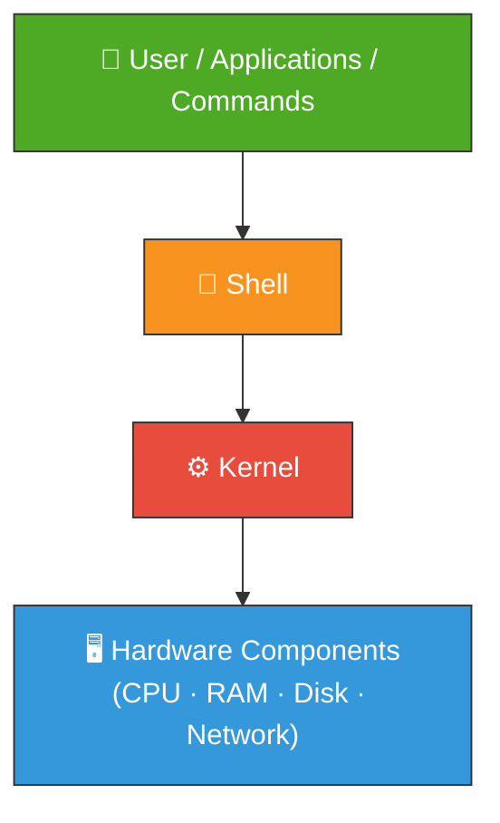
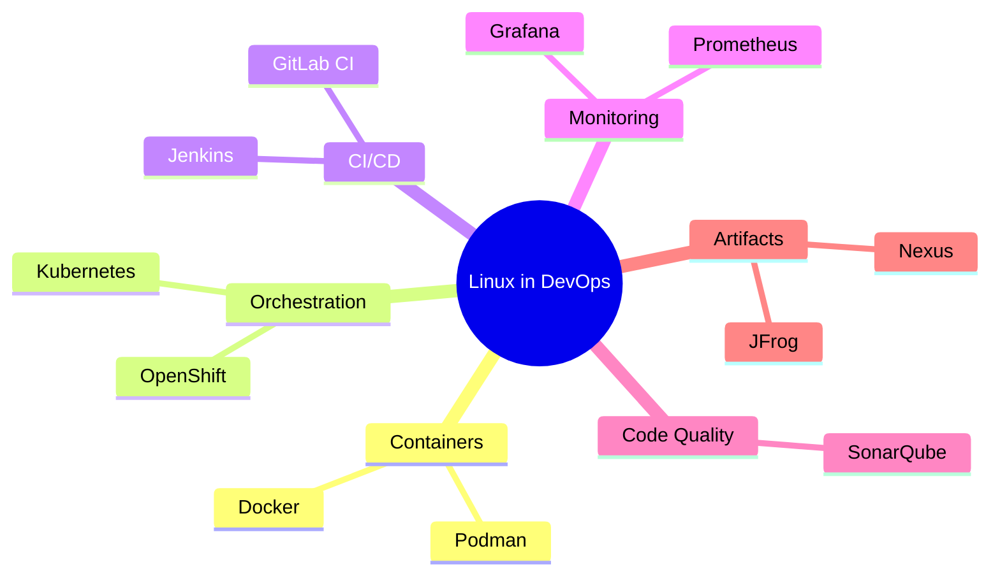

<div align="center">

# 🐧 Day 01 — Linux Architecture


> *"Understanding Linux architecture is the foundation of every DevOps engineer's journey."*

</div>

---

## 📌 Introduction

Linux is a **free, open-source, multi-user operating system** that is the backbone of modern infrastructure. Whether it's a Docker container, a Kubernetes cluster, or a Jenkins CI/CD pipeline — **Linux is underneath it all**.

| Feature | Description |
|---|---|
| 🆓 Free & Open Source | No licensing cost |
| 👥 Multi-User | Multiple users simultaneously |
| 🔒 Secure | Fine-grained permissions model |
| 💻 CLI-Based | Powerful command-line interface |
| 🚀 Server-Grade | Used for Docker, K8s, Jenkins, Nexus, SonarQube |

---

## 🧠 Key Concepts

### Linux Architecture — 4 Layers



### 🐚 What is Shell?
- Acts as a **mediator** between the user and the kernel
- Validates command syntax before passing to kernel
- Converts valid commands into kernel-understandable format

### ⚙️ What is Kernel?
- The **heart** of the Linux OS
- Mediator between Shell and Hardware
- Translates instructions into hardware-level operations

---

## 💻 Commands & Examples

```bash
# Check your default shell
echo $SHELL

# List all shells supported by your Linux VM
cat /etc/shells

# Print the current kernel version
uname -r

# Check current logged-in user
whoami

# Check current directory
pwd
```

### Common Shell Types

| Shell | Path | Description |
|---|---|---|
| Bash | `/bin/bash` | Most common, default on most distros |
| Sh | `/bin/sh` | POSIX-compliant shell |
| Zsh | `/bin/zsh` | Feature-rich, popular with devs |
| Fish | `/usr/bin/fish` | User-friendly shell |

---

## 🌍 Real-World Usage

Linux powers almost every major production system:



---

## 📋 Summary

| Component | Role |
|---|---|
| **Applications/Commands** | User-facing layer to interact with OS |
| **Shell** | Interprets and validates user commands |
| **Kernel** | Core engine communicating with hardware |
| **Hardware** | Physical resources (CPU, RAM, Disk) |

---

## ⏭️ What's Next?

> 🔜 **Day 02 — Shell Scripting & Sha-Bang**
> Learn how to write your first shell script and automate commands!

---

## 👨‍💻 Author & Support

<div align="center">

Made with ❤️ as part of the **DevOps Zero to Hero** series

[](https://github.com)
[](https://linkedin.com)

⭐ **Star this repo** if it helped you!

</div>
