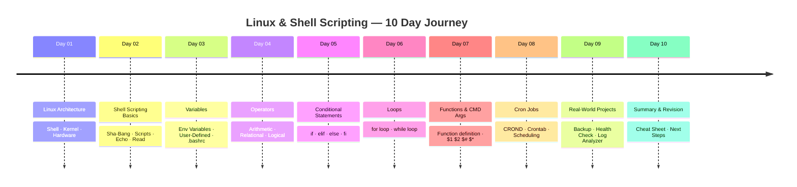
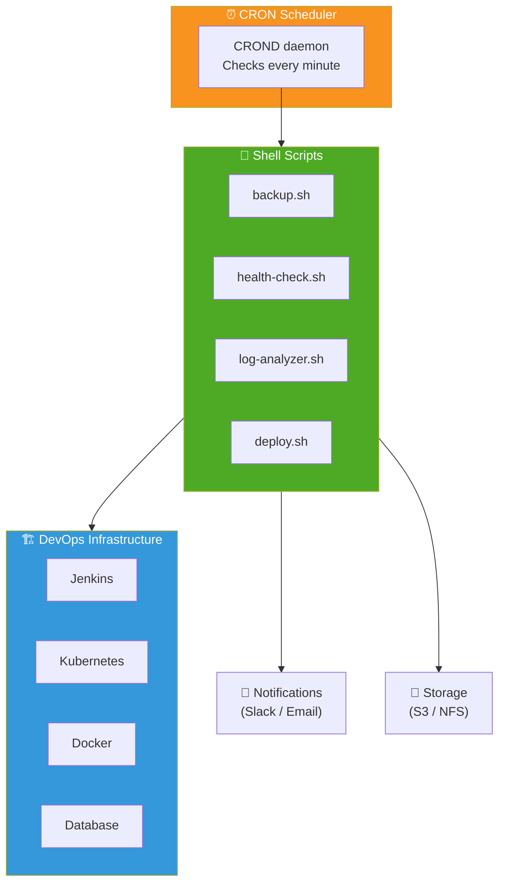

<div align="center">

# 🎓 Day 10 — Complete Linux & Shell Scripting Summary


> *"You've gone from zero to shell scripting hero. This is your foundation for everything DevOps."*

</div>

---

## 📌 Introduction

Day 10 is your **complete revision** of the entire Linux & Shell Scripting module. This serves as a quick reference guide, a cheat sheet, and a launchpad for your next DevOps topics.

---

## 🗺️ Full Learning Journey



---

## 📋 Master Cheat Sheet

### 🔧 Core Commands

```bash
echo $SHELL          # Current shell
uname -r             # Kernel version
whoami               # Current user
env                  # All environment variables
cat /etc/shells      # All available shells
```

### 📦 Variables

```bash
NAME=ashok           # Declare variable (no spaces)
echo $NAME           # Access variable
export VAR=value     # Temporary export
unset VAR            # Remove variable
source ~/.bashrc     # Reload .bashrc
```

### ➕ Arithmetic

```bash
echo $((10 + 5))     # 15
echo $((10 * 3))     # 30
echo $((10 % 3))     # 1
```

### 🔀 Conditionals

```bash
if [ $A -eq $B ]; then
    echo "Equal"
elif [ $A -gt $B ]; then
    echo "A greater"
else
    echo "B greater"
fi
```

### 🔁 For Loop

```bash
for (( i=1; i<=10; i++ ))
do
    echo $i
done
```

### 🔄 While Loop

```bash
N=1
while [ $N -le 10 ]
do
    echo $N
    let N++
done
```

### 🧩 Functions

```bash
function greet() {
    echo "Hello, $1"
}
greet "Ashok"
```

### 📥 Command Line Args

```bash
sh script.sh 10 20
# $1=10, $2=20, $#=2, $*="10 20"
```

### ⏰ Cron

```bash
crontab -e           # Edit cron jobs
crontab -l           # List cron jobs
crontab -r           # Remove all cron jobs

# Format: min hr dom mon dow command
0 9 * * * /bin/bash /home/ubuntu/script.sh
```

---

## 📊 Operators Quick Reference

| Type | Operator | Example |
|---|---|---|
| Arithmetic | `+`, `-`, `*`, `/`, `%` | `$((A+B))` |
| Numeric Equal | `-eq` | `[ $A -eq $B ]` |
| Numeric Not Equal | `-ne` | `[ $A -ne $B ]` |
| Greater Than | `-gt` | `[ $A -gt $B ]` |
| Less Than | `-lt` | `[ $A -lt $B ]` |
| Greater or Equal | `-ge` | `[ $A -ge $B ]` |
| Less or Equal | `-le` | `[ $A -le $B ]` |
| String Equal | `==` | `[ "$A" == "$B" ]` |
| String Not Equal | `!=` | `[ "$A" != "$B" ]` |
| Logical AND | `&&` | `[ c1 ] && [ c2 ]` |
| Logical OR | `\|\|` | `[ c1 ] \|\| [ c2 ]` |

---

## 🔢 CRON Quick Reference

| Expression | Runs When |
|---|---|
| `* * * * *` | Every minute |
| `*/15 * * * *` | Every 15 minutes |
| `0 9 * * *` | Daily at 9:00 AM |
| `0 0 * * 0` | Every Sunday midnight |
| `0 6 1 * *` | 1st of every month at 6 AM |
| `15 16 * * 1-5` | Weekdays at 4:15 PM |

---

## 🌍 Real-World Architecture



---

## ✅ What You've Learned

| Day | Topic | Skills Gained |
|---|---|---|
| 01 | Linux Architecture | Understand Shell → Kernel → Hardware flow |
| 02 | Shell Scripting Basics | Write and execute `.sh` scripts |
| 03 | Variables | Manage env & user variables, `.bashrc` |
| 04 | Operators | Arithmetic, relational, logical operations |
| 05 | Conditionals | Build decision-making scripts |
| 06 | Loops | Automate repetitive tasks |
| 07 | Functions & Args | Write reusable, dynamic scripts |
| 08 | CRON Jobs | Schedule automated tasks |
| 09 | Projects | Apply skills to real DevOps scenarios |
| 10 | Summary | Consolidated revision & reference |

---

## 🚀 What's Next in DevOps?


| Next Topic | Why It Matters |
|---|---|
| 🐙 **Git & GitHub** | Version control for scripts and code |
| 🐋 **Docker** | Containerize apps running on Linux |
| ☸️ **Kubernetes** | Orchestrate containers at scale |
| 🔁 **Jenkins** | CI/CD pipelines using shell scripts |
| ☁️ **AWS** | Cloud infra — Linux at its core |

---

## 📚 Resources

| Resource | Link |
|---|---|
| Cron Expression Builder | [crontab.guru](https://crontab.guru) |
| Linux Man Pages | `man <command>` in terminal |
| Bash Reference Manual | [gnu.org/software/bash](https://www.gnu.org/software/bash/) |
| Shell Script Checker | [shellcheck.net](https://www.shellcheck.net) |

---

## 👨‍💻 Author & Support

<div align="center">

### 🎉 Congratulations on completing the Linux & Shell Scripting module!

Made with ❤️ as part of the **DevOps Zero to Hero** series

[](https://github.com)
[](https://linkedin.com)

⭐ **Star this repo** if it helped you on your DevOps journey!

</div>
