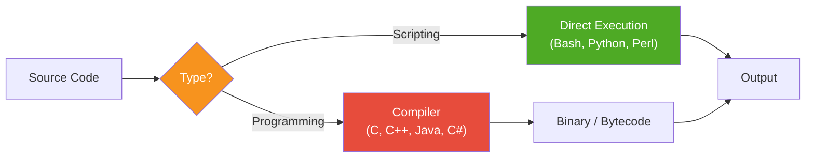
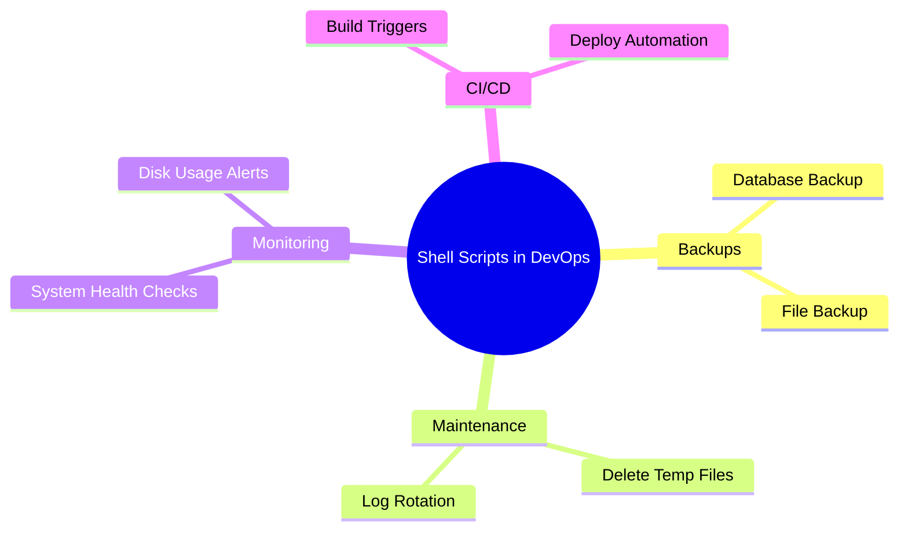
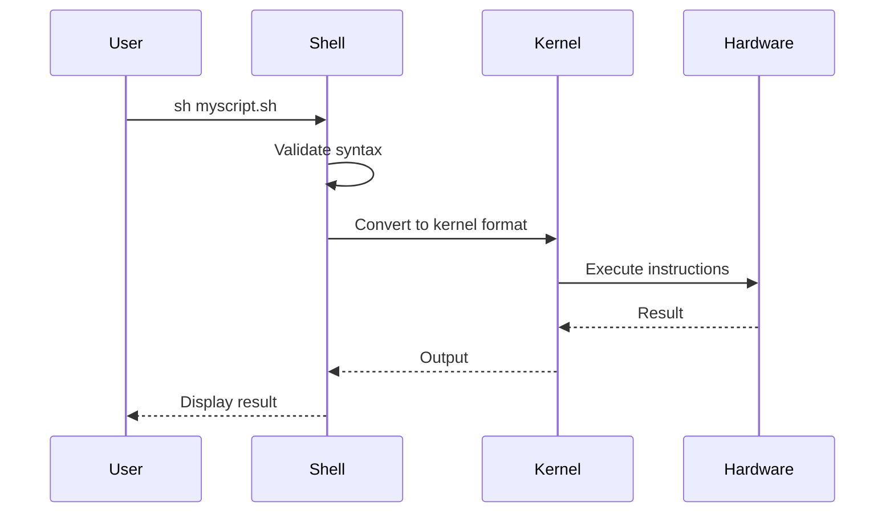

<div align="center">

# 📜 Day 02 — Shell Scripting Basics & Sha-Bang


> *"Automate the boring stuff — Shell scripting is your first superpower as a DevOps engineer."*

</div>

---

## 📌 Introduction

**Shell Scripting** is the process of writing a set of commands in a file and executing them together. It eliminates repetitive manual work and is a cornerstone skill in DevOps automation.

| Aspect | Detail |
|---|---|
| 📁 File Extension | `.sh` (e.g., `backup.sh`, `health-check.sh`) |
| ⚡ Execution | Direct — no compilation needed |
| 🔁 Use Case | Automation of daily/routine tasks |
| 🔧 Tool | Bash shell (most common) |

---

## 🧠 Key Concepts

### Scripting vs Programming



### 🔑 Sha-Bang (`#!`)

The **sha-bang** (shebang) tells the OS **which shell** to use when running the script.

```bash
#!/bin/bash    # Use Bash shell
#!/bin/sh      # Use POSIX sh shell
#!/usr/bin/env python3  # Use Python 3
```

> ⚠️ Writing sha-bang is **not mandatory** but **strongly recommended**.

---

## 💻 Commands & Examples

### Script 01 — Greet the User

```bash
#!/bin/bash

echo "Enter your name"
read NAME
echo "Good Evening, $NAME"
```

```bash
# Run the script
chmod +x script01.sh
sh script01.sh
```

---

### Script 02 — Full Name Input

```bash
#!/bin/bash

echo "Enter your first name"
read FNAME

echo "Enter your last name"
read LNAME

echo "Your Fullname : $FNAME $LNAME"
```

---

### Script 03 — Daily Routine Automation

```bash
#!/bin/bash
# Automates daily status checks

whoami
pwd
date
cal
ls -l
```

---

## 🌍 Real-World Use Cases



| Real-World Script | Purpose |
|---|---|
| `backup.sh` | Archive and backup directories |
| `log-analyzer.sh` | Parse and alert on error logs |
| `health-check.sh` | CPU, RAM, disk usage report |
| `cleanup.sh` | Remove temp/old files |
| `deploy.sh` | Pull code and restart services |

---

## 🔄 Script Execution Flow



---

## 📋 Summary

| Concept | Key Takeaway |
|---|---|
| **Shell Script** | A file with multiple commands executed together |
| **Sha-Bang** | Declares which shell interpreter to use |
| **`read`** | Accepts user input during script execution |
| **`echo`** | Prints output to the terminal |
| **`.sh` extension** | Standard extension for shell script files |

---

## ⏭️ What's Next?

> 🔜 **Day 03 — Variables in Shell Scripting**
> Learn Environment Variables, User-Defined Variables, `.bashrc`, and permanent variable setup!

---

## 👨‍💻 Author & Support

<div align="center">

Made with ❤️ as part of the **DevOps Zero to Hero** series

[](https://github.com)
[](https://linkedin.com)

⭐ **Star this repo** if it helped you!

</div>
