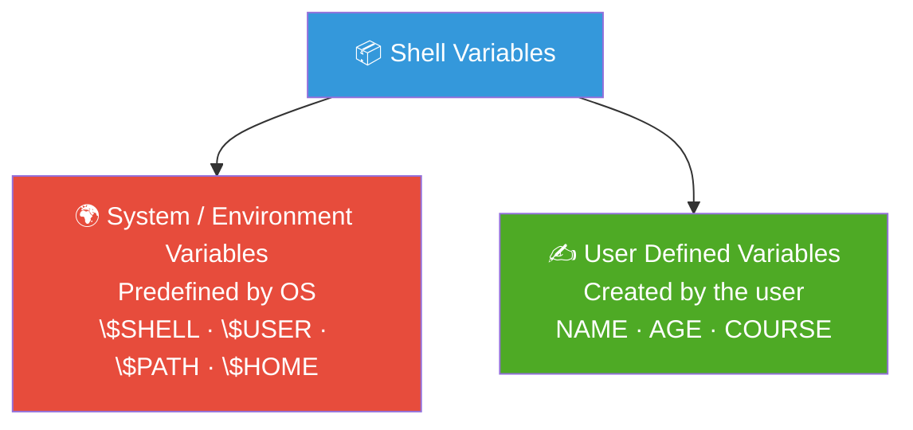
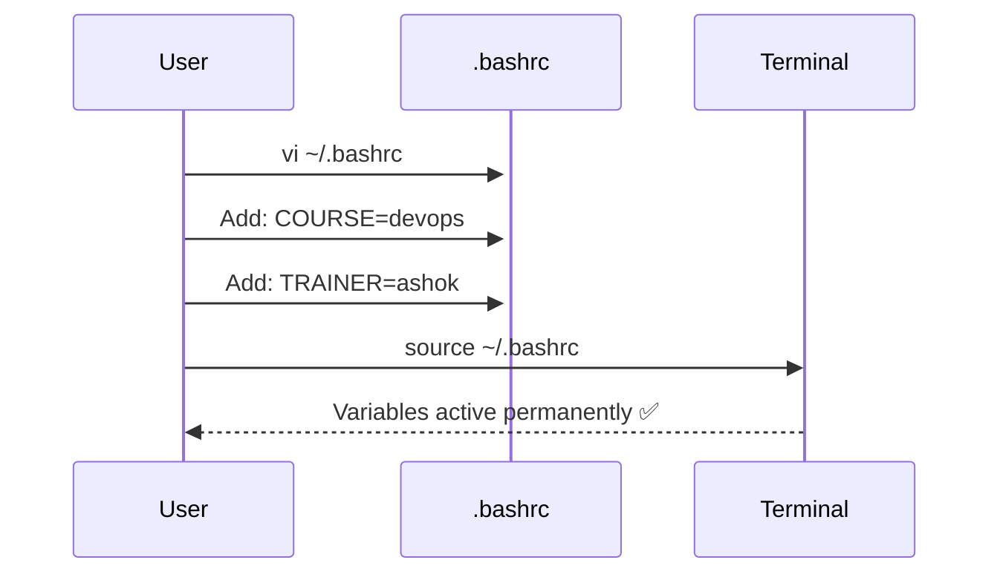

<div align="center">

# 📦 Day 03 — Variables in Shell Scripting


> *"Variables are the memory of your scripts — master them, and your automation becomes truly dynamic."*

</div>

---

## 📌 Introduction

**Variables** store values for reuse inside scripts. In shell scripting, there are **no strict data types** — a variable can hold numbers, strings, or paths equally.

```
KEY = VALUE
name = ashok
age  = 25
path = /home/user
```

---

## 🧠 Key Concepts

### Two Types of Variables



### Variable Naming Rules

| ✅ Allowed | ❌ Not Allowed |
|---|---|
| `MY_NAME`, `COURSE1` | Starting with a digit: `1NAME` |
| Uppercase recommended | Hyphens: `MY-NAME` |
| Underscores: `MY_VAR` | `@`, `#` in names |

---

## 💻 Commands & Examples

### System / Environment Variables

```bash
# Check default shell
echo $SHELL

# Check current user
echo $USER

# Check system PATH
echo $PATH

# Check home directory
echo $HOME

# List ALL environment variables
env
```

---

### User-Defined Variables

```bash
# Declare variables (no spaces around =)
NAME=ashok
AGE=25
COURSE=devops
GENDER=male

# Access variable value
echo $NAME
echo $AGE

# Create a temporary export variable (lost on terminal close)
export COURSE=devops
echo $COURSE

# Remove a variable
unset COURSE
```

---

### 🔒 Permanent Variables — `.bashrc`



```bash
# Open .bashrc file
vi ~/.bashrc

# Add at the bottom of the file:
COURSE=devops
TRAINER=ashok

# Apply changes without restarting terminal
source ~/.bashrc

# Verify
echo $COURSE
echo $TRAINER
```

---

### 🌐 Variables for ALL Users — `/etc/profile`

```bash
# View global profile
cat /etc/profile

# Edit to add variables for all users
sudo vi /etc/profile

# Add:
TEAM=devops
ENV=production
```

> ⚠️ Changes to `/etc/profile` affect **all** users on the system.

---

### Variable Scope Comparison

| Scope | File/Method | Affects |
|---|---|---|
| 🔴 Temporary | `export VAR=value` in terminal | Current session only |
| 🟡 User Permanent | `~/.bashrc` | Current user always |
| 🟢 System-Wide | `/etc/profile` | All users always |

---

### Script — Using Variables

```bash
#!/bin/bash

NAME=ashok
ROLE=devops-engineer
COMPANY=ashokit

echo "Name    : $NAME"
echo "Role    : $ROLE"
echo "Company : $COMPANY"
```

---

## 🌍 Real-World Usage

```bash
#!/bin/bash
# Real-world: Deploy script using variables

APP_NAME=myapp
ENV=production
DEPLOY_DIR=/opt/apps/$APP_NAME
BACKUP_DIR=/opt/backup/$APP_NAME

echo "Deploying $APP_NAME to $ENV environment..."
echo "Source : $DEPLOY_DIR"
echo "Backup : $BACKUP_DIR"
```

| Variable | Real-World Use |
|---|---|
| `$HOME` | Resolve user home paths in scripts |
| `$USER` | Log which user ran the script |
| `$PATH` | Ensure commands are found by the shell |
| `$APP_ENV` | Switch between dev/staging/prod configs |

---

## 📋 Summary

| Concept | Key Point |
|---|---|
| **System Variables** | Pre-defined by OS (`$SHELL`, `$USER`, `$PATH`) |
| **User Variables** | Defined by you (`NAME=ashok`) |
| **Temporary** | Set with `export` in terminal — lost on close |
| **Permanent (User)** | Set in `~/.bashrc` |
| **Permanent (Global)** | Set in `/etc/profile` |
| **Access** | Use `$VARIABLE_NAME` |
| **Remove** | Use `unset VARIABLE_NAME` |

---

## ⏭️ What's Next?

> 🔜 **Day 04 — Operators in Shell Scripting**
> Arithmetic, Relational, and Logical operators with hands-on examples!

---

## 👨‍💻 Author & Support

<div align="center">

Made with ❤️ as part of the **DevOps Zero to Hero** series

⭐ **Star this repo** if it helped you!

</div>
