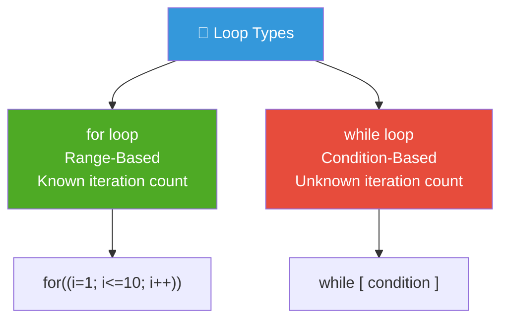
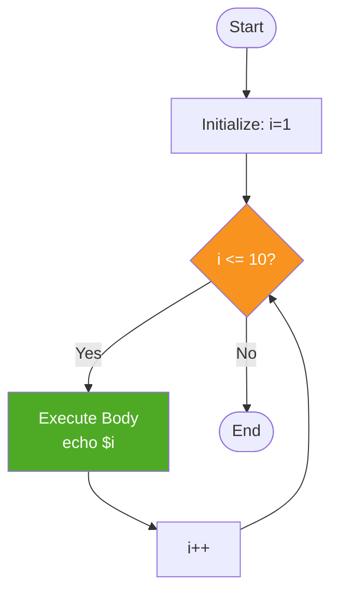
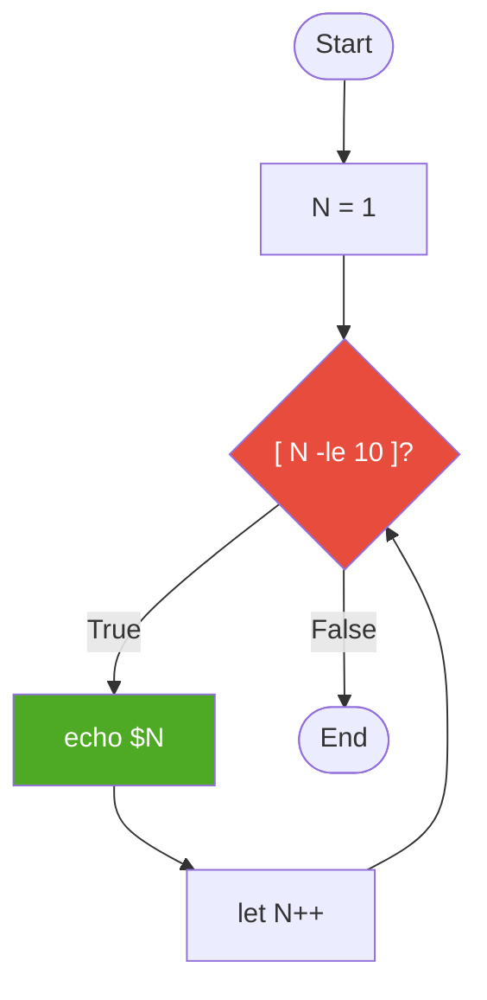

<div align="center">

# 🔁 Day 06 — Looping Statements (for & while)


> *"Loops are the engine of automation — do once what you'd otherwise repeat a thousand times."*

</div>

---

## 📌 Introduction

**Loops** execute a block of statements **multiple times**, either for a fixed range or until a condition becomes false. They are essential for bulk operations like processing files, retrying failed tasks, and iterating over server lists.

| Loop Type | Use When |
|---|---|
| `for` | You know the range/count in advance |
| `while` | You loop until a condition changes |

---

## 🧠 Key Concepts

### Loop Types Overview



---

## 💻 For Loop — Examples

### Syntax

```bash
for (( initialization; condition; modification ))
do
    # statements
done
```

---

### Script 01 — Print 1 to 10

```bash
#!/bin/bash

for (( i=1; i<=10; i++ ))
do
    echo $i
done
```

---

### Script 02 — Print 10 to 1 (Reverse)

```bash
#!/bin/bash

for (( i=10; i>=1; i-- ))
do
    echo $i
done
```

---

### Script 03 — Print Even Numbers from 1 to 20

```bash
#!/bin/bash

for (( i=1; i<=20; i++ ))
do
    if (( i % 2 == 0 )); then
        echo $i
    fi
done
```

---

### Script 04 — Multiplication Table

```bash
#!/bin/bash

echo "Enter a number"
read NUM

for (( i=1; i<=10; i++ ))
do
    echo "$NUM * $i = $((NUM * i))"
done
```

**Output for NUM=5:**
```
5 * 1 = 5
5 * 2 = 10
...
5 * 10 = 50
```

---

## 💻 While Loop — Examples

### Syntax

```bash
while [ condition ]
do
    # statements
done
```

---

### Script 05 — Print 1 to 10 using while

```bash
#!/bin/bash

N=1
while [ $N -le 10 ]
do
    echo $N
    let N++
done
```

---

### Script 06 — Print 10 to 1 using while

```bash
#!/bin/bash

N=10
while [ $N -gt 0 ]
do
    echo $N
    let N--
done
```

---

### Script 07 — Sum of N numbers

```bash
#!/bin/bash

echo "Enter limit"
read LIMIT
SUM=0
i=1

while [ $i -le $LIMIT ]
do
    SUM=$((SUM + i))
    let i++
done

echo "Sum from 1 to $LIMIT = $SUM"
```

---

## 🔄 Loop Flow Diagrams

### for loop



### while loop



---

## 🌍 Real-World Usage

```bash
#!/bin/bash
# Real-world: Ping multiple servers in a list

SERVERS=("server1" "server2" "server3" "db-host" "cache-host")

for SERVER in "${SERVERS[@]}"
do
    if ping -c 1 $SERVER &> /dev/null; then
        echo "✅ $SERVER is reachable"
    else
        echo "❌ $SERVER is UNREACHABLE"
    fi
done
```

---

## 📋 Summary

| Concept | for loop | while loop |
|---|---|---|
| **Use Case** | Known range/count | Condition-based |
| **Syntax Start** | `for((i=1; i<=N; i++))` | `while [ $N -le 10 ]` |
| **Block Opener** | `do` | `do` |
| **Block Closer** | `done` | `done` |
| **Increment** | In loop header `i++` | Manually `let N++` |

---

## ⏭️ What's Next?

> 🔜 **Day 07 — Functions & Command Line Arguments**
> Organize your scripts with reusable functions and pass dynamic inputs at runtime!

---

## 👨‍💻 Author & Support

<div align="center">

Made with ❤️ as part of the **DevOps Zero to Hero** series

⭐ **Star this repo** if it helped you!

</div>
