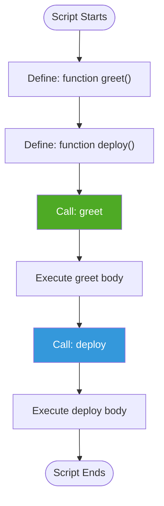
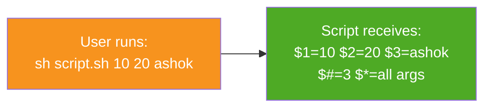

<div align="center">

# 🧩 Day 07 — Functions & Command Line Arguments


> *"Functions are the art of reuse — write once, call many times. Arguments make scripts truly dynamic."*

</div>

---

## 📌 Introduction

**Functions** help you organize scripts by grouping related commands under a named block. **Command Line Arguments** let you pass values to scripts at runtime — making them flexible and reusable without editing code.

| Concept | Benefit |
|---|---|
| 🧩 Functions | Reusable, organized, readable code |
| 📥 CMD Arguments | Dynamic runtime inputs — no hardcoding |

---

## 🧠 Key Concepts

### Functions — How They Work



### Command Line Arguments — How They Work



---

## 💻 Functions — Examples

### Syntax

```bash
# Define a function
function functionName() {
    # body / statements
}

# Call the function
functionName
```

---

### Script 01 — Basic Function

```bash
#!/bin/bash

function welcome() {
    echo "Welcome to AshoKit 🎉"
    echo "Welcome to DevOps 🚀"
    echo "Welcome to AWS ☁️"
}

# Call the function
welcome
```

---

### Script 02 — Multiple Functions

```bash
#!/bin/bash

function system_info() {
    echo "=== System Info ==="
    echo "User    : $(whoami)"
    echo "Host    : $(hostname)"
    echo "Date    : $(date)"
    echo "Uptime  : $(uptime -p)"
}

function disk_info() {
    echo "=== Disk Usage ==="
    df -h /
}

function memory_info() {
    echo "=== Memory Usage ==="
    free -h
}

# Call all functions
system_info
disk_info
memory_info
```

---

### Script 03 — Function with Parameters

```bash
#!/bin/bash

function greet_user() {
    local USERNAME=$1
    local ROLE=$2
    echo "Hello, $USERNAME! Your role is: $ROLE 👋"
}

# Call with arguments
greet_user "Ashok" "DevOps Engineer"
greet_user "Rahul" "Cloud Architect"
```

---

## 💻 Command Line Arguments

### Special Variables

| Variable | Meaning |
|---|---|
| `$1`, `$2`, `$3` | First, second, third argument |
| `$#` | Total number of arguments passed |
| `$*` | All arguments as a single string |
| `$0` | Script name itself |
| `$?` | Exit status of last command |

---

### Script 04 — Read Command Line Args

```bash
#!/bin/bash

echo "Script Name  : $0"
echo "Total Args   : $#"
echo "First Arg    : $1"
echo "Second Arg   : $2"
echo "All Args     : $*"
```

```bash
# Run the script
sh script.sh 10 20 ashok devops
```

**Output:**
```
Script Name  : script.sh
Total Args   : 4
First Arg    : 10
Second Arg   : 20
All Args     : 10 20 ashok devops
```

---

### Script 05 — Sum Using CMD Args

```bash
#!/bin/bash

echo "Result : $(($1 + $2))"
```

```bash
sh add.sh 15 25
# Output: Result : 40
```

---

### Script 06 — Validate CMD Args Count

```bash
#!/bin/bash

if [ $# -ne 2 ]; then
    echo "❌ Usage: sh script.sh <num1> <num2>"
    exit 1
fi

echo "Sum : $(($1 + $2))"
```

---

## 🌍 Real-World Usage

```bash
#!/bin/bash
# Real-world: Deployment script with functions & args

APP_NAME=$1
ENV=$2

function validate_args() {
    if [ $# -lt 2 ]; then
        echo "❌ Usage: sh deploy.sh <app_name> <environment>"
        exit 1
    fi
}

function deploy() {
    echo "🚀 Deploying $APP_NAME to $ENV..."
    echo "✅ Deployment complete!"
}

function notify() {
    echo "📢 Notification sent for $APP_NAME deployment on $ENV"
}

validate_args $1 $2
deploy
notify
```

```bash
# Call the script
sh deploy.sh myapp production
```

---

## 📋 Summary

| Concept | Key Points |
|---|---|
| **Function Definition** | `function name() { ... }` |
| **Function Call** | Just write `functionName` |
| **Local Variables** | Use `local VAR=value` inside functions |
| **`$1`, `$2`** | Access positional command line arguments |
| **`$#`** | Count of arguments passed |
| **`$*`** | All arguments together |
| **`$0`** | Script name |

---

## ⏭️ What's Next?

> 🔜 **Day 08 — Cron Jobs & Scheduling**
> Automate script execution on a schedule using Linux CRON!

---

## 👨‍💻 Author & Support

<div align="center">

Made with ❤️ as part of the **DevOps Zero to Hero** series

⭐ **Star this repo** if it helped you!

</div>
