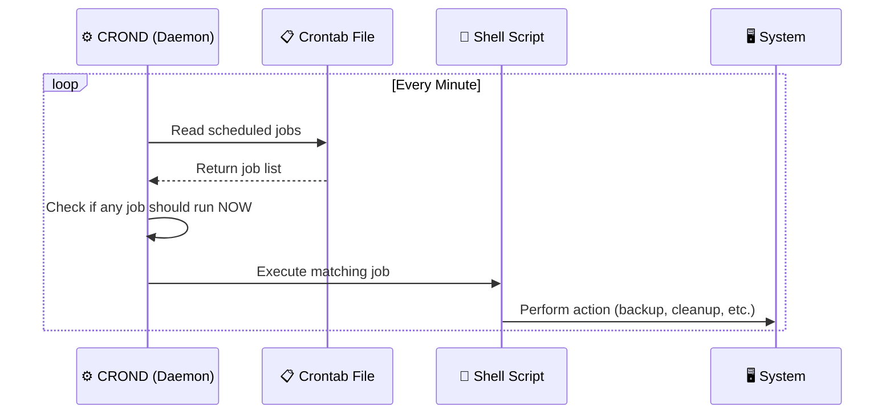
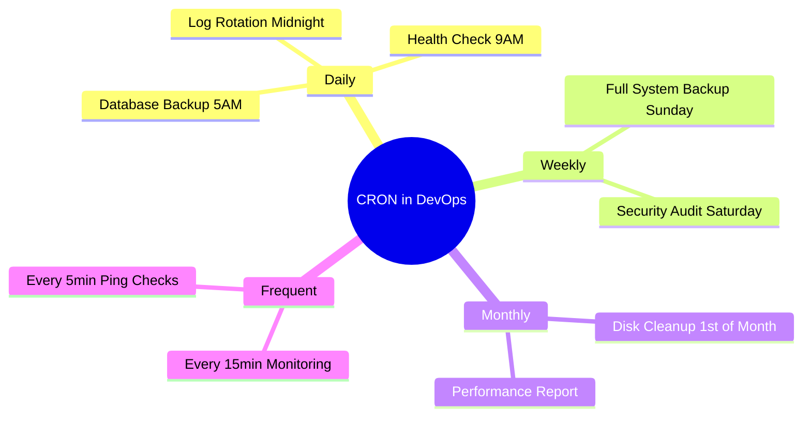

<div align="center">

# ⏰ Day 08 — Cron Jobs & Scheduling


> *"A script that runs itself is ten times more powerful than one you run manually."*

</div>

---

## 📌 Introduction

**Cron** is a Linux utility for **scheduling tasks** to run automatically at specific times or intervals. Instead of manually running scripts, CRON handles the execution — daily, weekly, or even every minute.

| What | Description |
|---|---|
| 🕐 CRON | Scheduling utility in Linux |
| 👁️ CROND | Background daemon that checks for jobs every minute |
| 📋 Crontab | Configuration file where job schedules are stored |

---

## 🧠 Key Concepts

### How CRON Works



---

### Crontab Syntax

```
*  *  *  *  *  /path/to/script.sh
│  │  │  │  │
│  │  │  │  └── Day of Week  (0–6, Sun=0)
│  │  │  └───── Month        (1–12)
│  │  └──────── Day of Month (1–31)
│  └─────────── Hour         (0–23)
└────────────── Minute       (0–59)
```

---

## 💻 Commands & Examples

### Crontab Management Commands

```bash
# Open crontab file (edit job schedules)
crontab -e

# List all current scheduled jobs
crontab -l

# Remove/delete crontab file (all jobs)
crontab -r
```

---

### CRON Schedule Examples

| Schedule | Expression | Meaning |
|---|---|---|
| Every minute | `* * * * *` | Runs every single minute |
| Every 15 mins | `*/15 * * * *` | Every 15 minutes |
| Every day at 5 AM | `0 5 * * *` | Daily at 05:00 |
| Every day at 5 PM | `0 17 * * *` | Daily at 17:00 |
| Monthly (1st, 9 AM) | `0 9 1 * *` | First of month at 09:00 |
| Weekdays at 4:15 PM | `15 16 * * 1-5` | Mon–Fri at 16:15 |
| Every Sunday at midnight | `0 0 * * 0` | Weekly on Sunday |

```bash
# Examples in crontab file:

# Run backup every 15 mins
*/15 * * * * /bin/bash /home/ubuntu/backup.sh

# Run health check every day at 9 AM
0 9 * * * /bin/bash /home/ubuntu/health-check.sh

# Delete temp files every Sunday at midnight
0 0 * * 0 /bin/bash /home/ubuntu/cleanup.sh

# Run deploy script on 1st of every month at 6 AM
0 6 1 * * /bin/bash /home/ubuntu/deploy.sh

# Weekday log analysis at 4:15 PM
15 16 * * 1-5 /bin/bash /home/ubuntu/log-analyzer.sh
```

> 💡 **Tip:** Use [https://crontab.guru](https://crontab.guru) to build and verify CRON expressions.

---

### Full Practical Setup

```bash
# Step 1: Create the shell script
vi /home/ubuntu/task.sh
```

```bash
#!/bin/bash
# task.sh — creates marker files

touch /home/ubuntu/f1.txt
touch /home/ubuntu/f2.txt
echo "Task ran at $(date)" >> /home/ubuntu/task.log
```

```bash
# Step 2: Give execute permission
chmod +x /home/ubuntu/task.sh

# Step 3: Open crontab and add schedule
crontab -e
```

```
# Run every 1 minute
*/1 * * * * /bin/bash /home/ubuntu/task.sh
```

```bash
# Step 4: Verify files were created
ls -l /home/ubuntu/

# Step 5: Check log
cat /home/ubuntu/task.log
```

---

## 🌍 Real-World Usage



```bash
#!/bin/bash
# Real-world: System health report cron script

REPORT="/var/log/health-$(date +%Y%m%d).log"

echo "=== Health Report: $(date) ===" > $REPORT
echo "CPU Usage : $(top -bn1 | grep 'Cpu(s)' | awk '{print $2}')%" >> $REPORT
echo "Memory    : $(free -h | awk '/^Mem:/ {print $3 "/" $2}')" >> $REPORT
echo "Disk      : $(df -h / | awk 'NR==2 {print $5 " used"}')" >> $REPORT
echo "Services  : nginx=$(systemctl is-active nginx)" >> $REPORT

echo "✅ Health report saved to $REPORT"
```

**Crontab entry:**
```
0 9 * * * /bin/bash /home/ubuntu/health-report.sh
```

---

## 📋 Summary

| Concept | Description |
|---|---|
| **CRON** | Linux task scheduling utility |
| **CROND** | Daemon that runs every minute checking for jobs |
| **Crontab** | File storing scheduled job configurations |
| **`crontab -e`** | Edit/add job schedules |
| **`crontab -l`** | List all current jobs |
| **`crontab -r`** | Remove all cron jobs |
| **`*/N`** | Run every N units (e.g., `*/15` = every 15 mins) |

---

## ⏭️ What's Next?

> 🔜 **Day 09 — Real-World Shell Script Projects**
> Put everything together — build backup, monitoring, and deployment scripts from scratch!

---

## 👨‍💻 Author & Support

<div align="center">

Made with ❤️ as part of the **DevOps Zero to Hero** series

[](https://github.com)
[](https://linkedin.com)

⭐ **Star this repo** if it helped you!

</div>
