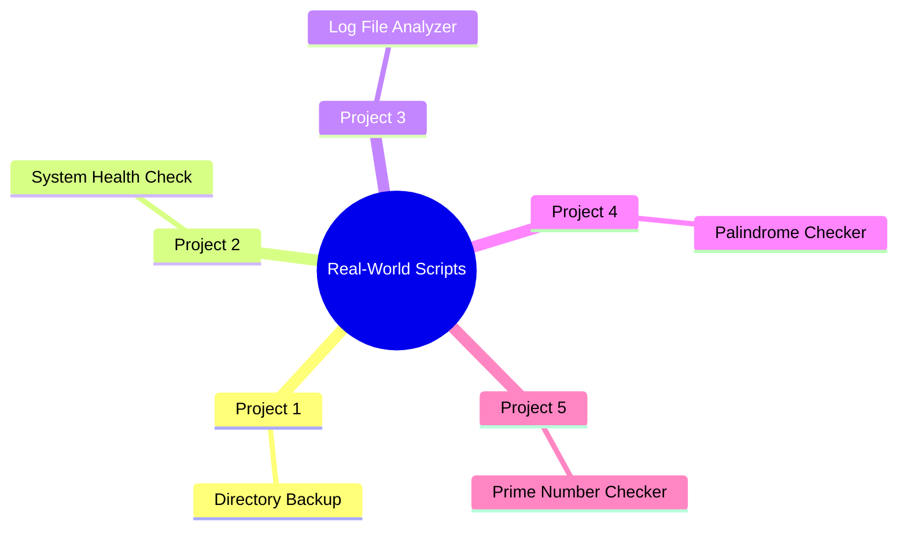
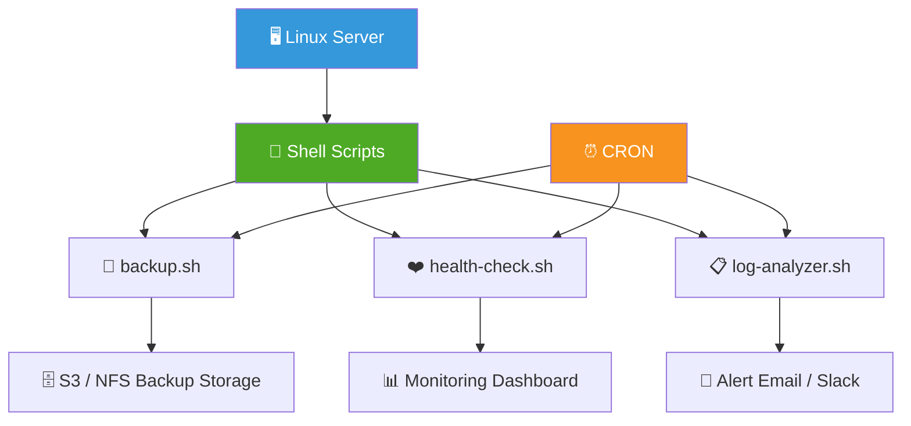

<div align="center">

# 🛠️ Day 09 — Real-World Shell Script Projects


> *"Theory without practice is empty. Here's where your scripts start solving real problems."*

</div>

---

## 📌 Introduction

This day is about **applying everything you've learned** — variables, loops, conditions, functions, and cron jobs — into practical, production-grade shell scripts that DevOps engineers use daily.

---

## 🧠 Project Overview



---

## 💻 Project 01 — Directory Backup Script

```bash
#!/bin/bash
# backup.sh — Backup /home/ec2-user directory with timestamp

SOURCE_DIR="/home/ec2-user"
BACKUP_DIR="/opt/backups"
TIMESTAMP=$(date +%Y%m%d_%H%M%S)
BACKUP_FILE="$BACKUP_DIR/backup_$TIMESTAMP.tar.gz"

# Create backup directory if not exists
mkdir -p $BACKUP_DIR

# Create compressed archive
tar -czf $BACKUP_FILE $SOURCE_DIR

if [ $? -eq 0 ]; then
    echo "✅ Backup successful: $BACKUP_FILE"
else
    echo "❌ Backup FAILED!"
    exit 1
fi

# Keep only last 7 backups
ls -t $BACKUP_DIR/backup_*.tar.gz | tail -n +8 | xargs -r rm -f
echo "🧹 Old backups cleaned up."
```

**Cron — Run daily at 2 AM:**
```
0 2 * * * /bin/bash /home/ec2-user/backup.sh
```

---

## 💻 Project 02 — System Health Check

```bash
#!/bin/bash
# health-check.sh — Monitor CPU, Memory, Disk

REPORT_FILE="/var/log/health-$(date +%Y%m%d).log"
CPU_THRESHOLD=80
DISK_THRESHOLD=85
MEM_THRESHOLD=80

function check_cpu() {
    CPU=$(top -bn1 | grep "Cpu(s)" | awk '{print int($2)}')
    echo "CPU Usage  : $CPU%"
    if [ $CPU -ge $CPU_THRESHOLD ]; then
        echo "⚠️  WARNING: High CPU usage - $CPU%"
    fi
}

function check_memory() {
    USED=$(free | awk '/^Mem:/ {printf "%.0f", $3/$2 * 100}')
    echo "Memory Use : $USED%"
    if [ $USED -ge $MEM_THRESHOLD ]; then
        echo "⚠️  WARNING: High Memory usage - $USED%"
    fi
}

function check_disk() {
    DISK=$(df / | tail -1 | awk '{print int($5)}')
    echo "Disk Usage : $DISK%"
    if [ $DISK -ge $DISK_THRESHOLD ]; then
        echo "⚠️  WARNING: High Disk usage - $DISK%"
    fi
}

{
    echo "===== Health Report: $(date) ====="
    check_cpu
    check_memory
    check_disk
    echo "====================================="
} | tee $REPORT_FILE

echo "📄 Report saved to $REPORT_FILE"
```

---

## 💻 Project 03 — Log File Analyzer

```bash
#!/bin/bash
# log-analyzer.sh — Scan logs for ERROR/WARNING entries

LOG_FILE="/var/log/syslog"
OUTPUT="/tmp/log-report-$(date +%Y%m%d).txt"

echo "===== Log Analysis: $(date) =====" > $OUTPUT
echo "" >> $OUTPUT

echo "🔴 ERROR Count   : $(grep -c 'ERROR' $LOG_FILE)" >> $OUTPUT
echo "🟡 WARNING Count : $(grep -c 'WARNING' $LOG_FILE)" >> $OUTPUT
echo "🔵 INFO Count    : $(grep -c 'INFO' $LOG_FILE)" >> $OUTPUT

echo "" >> $OUTPUT
echo "--- Recent ERRORS ---" >> $OUTPUT
grep 'ERROR' $LOG_FILE | tail -10 >> $OUTPUT

cat $OUTPUT
echo "✅ Analysis saved to $OUTPUT"
```

---

## 💻 Project 04 — Palindrome Checker

```bash
#!/bin/bash
# palindrome.sh — Check if input string is a palindrome

echo "Enter a string"
read INPUT

REVERSED=$(echo $INPUT | rev)

if [ "$INPUT" == "$REVERSED" ]; then
    echo "✅ '$INPUT' IS a Palindrome"
else
    echo "❌ '$INPUT' is NOT a Palindrome"
fi
```

**Test:**
```bash
sh palindrome.sh
# Input: madam   → ✅ IS a Palindrome
# Input: ashok   → ❌ NOT a Palindrome
```

---

## 💻 Project 05 — Prime Number Checker

```bash
#!/bin/bash
# prime.sh — Check if a given number is prime

echo "Enter a number"
read NUM

if [ $NUM -le 1 ]; then
    echo "❌ $NUM is NOT a prime number"
    exit 0
fi

IS_PRIME=true

for (( i=2; i<=NUM/2; i++ ))
do
    if (( NUM % i == 0 )); then
        IS_PRIME=false
        break
    fi
done

if $IS_PRIME; then
    echo "✅ $NUM IS a prime number"
else
    echo "❌ $NUM is NOT a prime number"
fi
```

---

## 🌍 How These Fit Into DevOps



---

## 📋 Summary

| Project | Script | Key Concepts Used |
|---|---|---|
| 🗂️ Backup | `backup.sh` | Variables, tar, date, CRON |
| ❤️ Health Check | `health-check.sh` | Functions, conditions, CRON |
| 📋 Log Analyzer | `log-analyzer.sh` | grep, tee, output redirect |
| 🔤 Palindrome | `palindrome.sh` | String comparison, `rev` |
| 🔢 Prime Number | `prime.sh` | Loops, conditions, break |

---

## ⏭️ What's Next?

> 🔜 **Day 10 — Complete Linux & Shell Scripting Summary**
> Recap everything, revision guide, and next steps in your DevOps journey!

---

## 👨‍💻 Author & Support

<div align="center">

Made with ❤️ as part of the **DevOps Zero to Hero** series

[](https://github.com)
[](https://linkedin.com)

⭐ **Star this repo** if it helped you!

</div>
